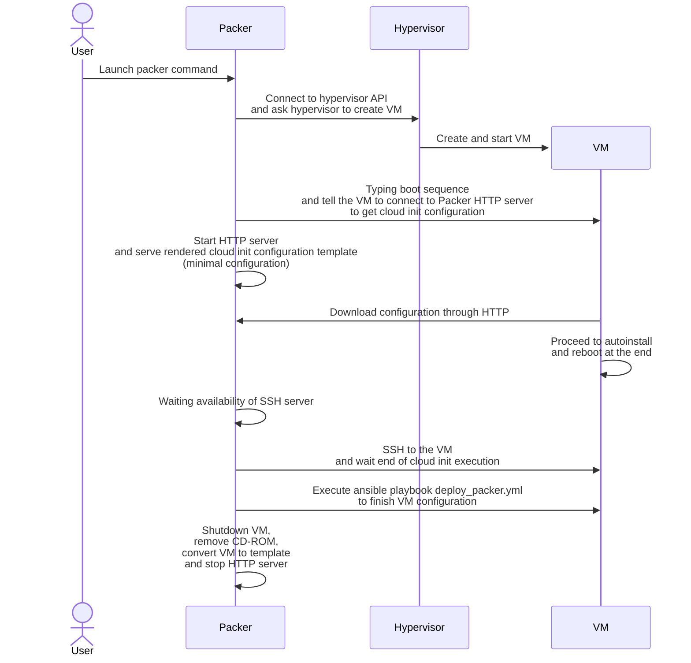

# Packer

## What is Packer ?

[Packer](https://www.packer.io/) gives the ability to automate image builds. It will allow us to create customized template with pre-defined generic configuration.

## List of supported configuration

Version is pinned in configuration file.

Hypervisors:

* [Proxmox](https://www.proxmox.com/en/)

Distributions :

* Ubuntu

## How does it works ?



## How to open/close ports ?

`PORT` represents the packer http server port

* Open port

    === "Iptables"

        ```sh
        iptables -A INPUT -p tcp --dport <PORT> -j ACCEPT -m comment --comment "Packer"
        ```

    === "Ufw"

        ```sh
        ufw allow <PORT>/tcp comment "Packer"
        ```

    === "Nixos"

        ```sh
        nixos-firewall-tool open tcp <PORT>
        ```

* Close port

    === "Iptables"

        ```sh
        iptables -D INPUT -p tcp --dport <PORT> -j ACCEPT -m comment --comment "Packer"
        ```

    === "Ufw"

        ```sh
        ufw delete allow <PORT>/tcp
        ```

    === "Nixos"

        ```sh
        nixos-firewall-tool reset
        ```

## Usage

Configuration is stored in `packer` folder.

Packer use 8888/tcp port for this HTTP server.

`PROXMOX_PASSWORD` represents the proxmox password used for HTTP API

Init plugins

```sh
uv run task packer:init
```

Generate ubuntu template

```sh
uv run task packer:ubuntu
```
