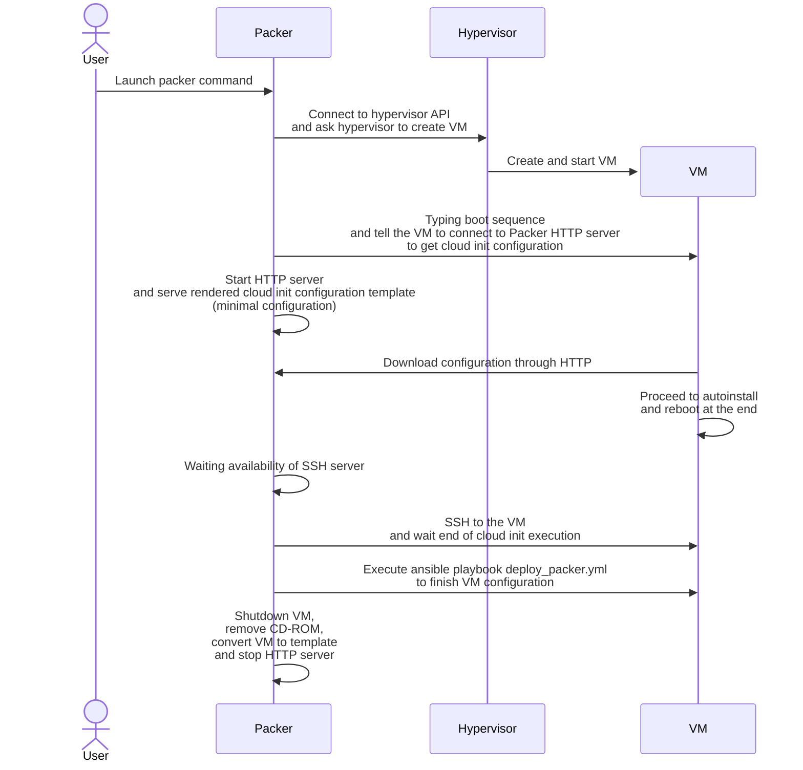

# Packer

## What is Packer ?

[Packer](https://www.packer.io/) gives the ability to automate image builds. It will allow us to create customized template with pre-defined generic configuration.

## List of supported configuration

Version is pinned in configuration file.

Hypervisors:

* [Proxmox](https://www.proxmox.com/en/)

Distributions :

* Ubuntu

## How does it works ?



## How to open/close ports ?

`PORT` represents the packer http server port

* Open port

    === "Iptables"

        ```sh
        iptables -A INPUT -p tcp --dport <PORT> -j ACCEPT -m comment --comment "Packer"
        ```

    === "Ufw"

        ```sh
        ufw allow <PORT>/tcp comment "Packer"
        ```

* Close port

    === "Iptables"

        ```sh
        iptables -D INPUT -p tcp --dport <PORT> -j ACCEPT -m comment --comment "Packer"
        ```

    === "Ufw"

        ```sh
        ufw delete allow <PORT>/tcp
        ```

??? question "How to expose packer HTTP server from WSL ?"
    `WINDOWS IP` represents the IP used to connect  
    `WINDOWS PORT` represents the port used to connect  
    `WSL PORT` represents the packer http server port that will be accessible through `<WINDOWS IP>:<WINDOWS PORT>`  

    * To create a port forwarding rule open powershell prompt with admin right

        ```powershell
        New-NetFirewallRule -DisplayName 'Packer' -Direction Inbound -Protocol TCP -LocalPort <WINDOWS PORT> -Action Allow
        netsh interface portproxy add v4tov4 listenaddress=<WINDOWS IP> connectaddress=127.0.0.1 listenport=<WINDOWS PORT> connectport=<WSL PORT>
        ```

    * To delete a port forwarding rule open powershell prompt with admin right

        ```powershell
        Remove-NetFirewallRule -DisplayName 'Packer'
        netsh interface portproxy del v4tov4 listenaddress=<WINDOWS IP> listenport=<WINDOWS PORT>
        ```

## Usage

Configuration is stored in `packer` folder.

Some variables are hardcoded in the bash script, this script will be replaced by a python script in near future.  
Packer use 8888/tcp port for this HTTP server.

`PROXMOX_PASSWORD` represents the proxmox password used for HTTP API

```sh
cd packer
packer build \
  -var "proxmox_password=<PROXMOX_PASSWORD>" \
  -timestamp-ui \
  templates/ubuntu
```
