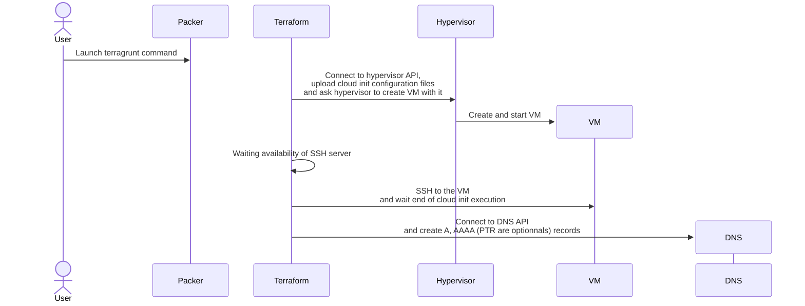

# Terraform

## What is Terraform ?

[Terraform](https://www.terraform.io/) gives the ability to automate provision and to manage resources in any cloud or data center in a stateful manner. It will allow us to deploy virtual machine from a customized packer template with pre-defined generic configuration.

## What is Terragrunt ?

[Terragrunt](https://terragrunt.gruntwork.io/) is a thin wrapper that provides extra tools for keeping your configurations DRY, working with multiple Terraform modules, and managing remote state.

## List of supported configuration

Version is pinned in configuration file.

Hypervisors:

* [Proxmox](https://www.proxmox.com/en/)

DNS :

* [PowerDNS](https://www.powerdns.com/)

## How does it works ?



## Usage

```sh
cd terraform/prod
terragrunt run-all apply
```

??? question "How to execute only a part of terraform deployment ?"
    * Deploy a group of machine

        Move over a subdirectory like `dhcp` and run the same command

    * Deploy one machine in a group

        Move over a subdirectory like `dhcp/dchp1` and run the same command
